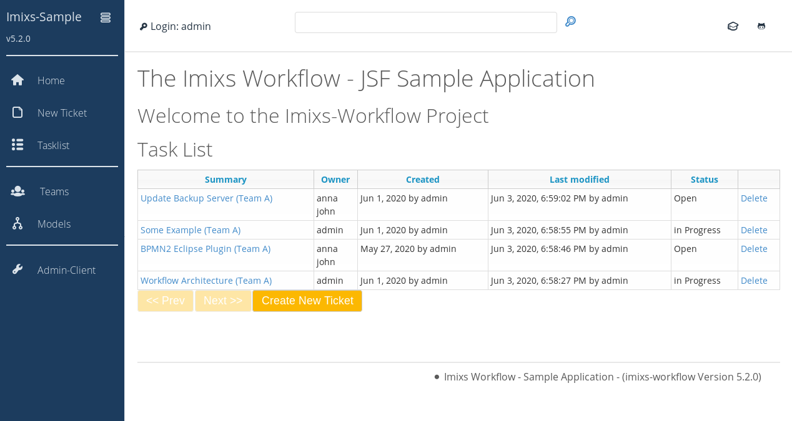

# imixs-jsf-example

The Imixs-jsf-example provides a simple web application using the imixs workflow engine.
You can take this application as a scaffolding for your own web business application based on the [Imixs-Workflow project](http://www.imixs.org).

## 1. Build the Application

The Imixs-jsf-example  is based on Maven to build the project from sources run

    mvn clean install
    
You can also download the application from the [latest release](https://github.com/imixs/imixs-jsf-example/releases).    

## 2. Deploy the Application
To deploy the application successfully, the application sever need to provide a valid database pool named 'jdbc/workflow' and a JAAS security configuration named 'imixsrealm'. You will find an installation guide [here](http://www.imixs.org/doc/sampleapplication.html).

### Authentication and Authorization

Imixs-Workflow is a human-centry workflow engine which means that each actor need to authenticate against the service to interact. The Workflow Engine is based on Java EE and so the authentication is also standardized by the JAAS Specification which supports different authentication solutions like LDAP, Database, SSO and more.  

The default Docker setup in this project provides a set of predefined users which can be used for testing purpose. The test users are stored in a separate user and roles properties file named 'sampleapp-roles.roperties' and 'sampleapp-users.properties'. The property files are configured in a file based security domain within the server configuration. See the following list of predefined test user accounts:

| User    | Role                   | Password |
|---------|------------------------|----------|
| admin   | IMIXS-WORKFLOW-Manager | adminadmin |
| manfred | IMIXS-WORKFLOW-Manager | password |
| alex    | IMIXS-WORKFLOW-Manager | password |
| anna    | IMIXS-WORKFLOW-Author  | password |
| marty   | IMIXS-WORKFLOW-Author  | password |
| melman  | IMIXS-WORKFLOW-Author  | password |
| gloria  | IMIXS-WORKFLOW-Author  | password |
| skipper | IMIXS-WORKFLOW-Author  | password |
| kowalski| IMIXS-WORKFLOW-Author  | password |
| private | IMIXS-WORKFLOW-Author  | password |
| rico    | IMIXS-WORKFLOW-Author  | password |

You can add additional accounts or change the default account later, by updated the files "_sampleapp-roles.properties_" and "_sampleapp-users.properties_". You can also configure a different custom security realm (e.g. LDAP or Database). 

You will find more information about the security concept of the [Imixs-Workflow Deployent guide](http://www.imixs.org/doc/deployment/security.html).

## 3. Run the Application
After deployment you can start the sample application from:

[http://localhost:8080/](http://localhost:8080/)

  

# The Imixs Rest-API

Imixs-Workflow provides a powerfull Rest API. Also the JSF-Sample Application has included this API which is based on the jax-rs specification. 
To access the rest api in this sample application use the root api URL:

    http://localhost:8080/api/

Find details about the Imixs REST api [here](http://www.imixs.org/doc/restapi/index.html). 

## Upload the BPMN Model:

After you have successful deployed your application you can upload the Ticket workflow model via the [Imixs-REST Service API](http://www.imixs.org/doc/restapi/index.html). 

  

Use the following curl command to upload the model from your workspace:

    curl --user admin:adminpassword --request POST -Tsrc/workflow/ticket.bpmn http://localhost:8080/api/model/bpmn

The BPMN Model is part of the project and located under /src/workflow/ticket.bpmn

**NOTE:** cURL isn't installed in Windows by default. See the [Use Curl on Windows](https://stackoverflow.com/questions/9507353/how-do-i-install-and-use-curl-on-windows) discussion on stackoverflow.

## Reporting

Imixs-Workflow provides a reporting interface which can be accessed by the [Imixs Rest API](http://www.imixs.org/doc/restapi/reportservice.html). A report definition can be created with the Eclipse Plug-in "Imixs-Report" which is part of the [Imixs-BPMN project](http://www.imixs.org/doc/modelling/index.html).

A new report definition can be uploaded with the curl commandline tool:

    curl --user admin:adminpassword --request POST -H "Content-Type: application/xml" -Tsrc/workflow/tickets.imixs-report http://localhost:8080/api/report

  

The Imixs-JSF-Example includes a Docker Container to run the sample application in a Docker container. 
The docker image is based on the docker image [imixs/wildfly](https://hub.docker.com/r/imixs/wildfly/).

To run Sample Application in a Docker container, the container need to be linked to a postgreSQL database container. The database connection is configured in the Wildfly standalone.xml file and can be customized to any other database system. 

## 1. Build the Application
Before you can start the container, build the application and the docker image from sources:

	mvn clean install -Pdocker-build
	
## 2. Starting the Application in a Docker Container

After you have build the application and the Docker image you can start the application. The workflow engine needs a SQL Database. Both containers can be started with one docker-compose command

	docker-compose up

See the docker-compose.yml file for details

The Docker container creates user accounts for testing with the following userid/password:

    admin=adminpassword
    manfred=password
    anna=password

After your application was started, upload the ticket.bpmn example model:

	curl --user admin:adminpassword --request POST -Tticket.bpmn http://localhost:8080/api/model/bpmn

and run the application in a web browser:	

	http://localhost:8080/
	
	
## Development

During development you can use the docker-compose-dev.yml file. This stack maps the src/docker/deployments folder to the wildfly auto deploy directory. 

	$ docker-compose -f docker-compose-dev.yml up
	
you may have to grant the deployment folder first to allow the docker non privileged user to access this location.

	$ sudo chmod 777 src/docker/deployments/
	
## GlassFish / Payara

The Imixs-JSF-Sample application includes also a setup to run Payara on Docker. You can find additional information [here](src/docker/configuration/payara/).	
	 
	 
## Open Liberty 

To run the 	 Imixs-JSF-Sample application on the Open Liberty Application Server with Docker run:

	$ mvn clean install -Pdocker-build-openliberty
	$ docker-compose -f docker-compose-openliberty.yml up
	
	
	
	
	
	
	